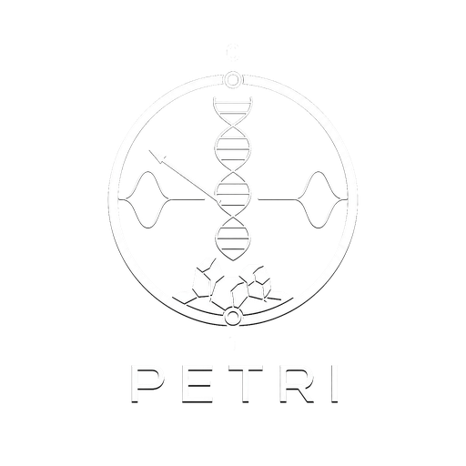

# Petri

Desktop agent workspace. Tauri + Svelte over official `agy` login — no API keys in the app.

Petri keeps durable threads, forks sub-tasks, and talks to the workspace through a composer. Auth is the Antigravity CLI session (`agy`) plus Google account credentials. Model calls never take `GEMINI_API_KEY` / `GOOGLE_API_KEY` from this repo.

<p align="center">
  
</p>

## What it does

- **Threads** — `/new` `/goto` `/tree` `/resume` `/fork` `/task` `/project` `/export` `/open-agy` `/stop`
- **Memory** — `/umb` `/remember` `/recall` `/index` `/learn`
- **Modes** — ask / architect / orchestrator / code / debug, with fences applied *before* spawn
- **Skills & modules** — `/skills` `/plugin` `/mcp`; drop JS in `modules/` to register slash commands
- **Security** — secret redaction (`ghp_`, `sk-`, `AIza`, Bearer, env-style keys), PAT at `~/.mesh/github.pat` mode `0600`, argv-only subprocesses (no `sh -c` interpolation)

State lives in `$HOME/.mesh` (`mesh.db`, lessons, resume cache). Tests inject a temp dir and never touch the user database.

## Requirements

- Node.js 20+
- Rust (stable) + [Tauri 2](https://v2.tauri.app/) Linux deps
- `agy` (Antigravity CLI) on `PATH` and a Google login

## Run

```bash
npm install
npm run tauri dev
```

Frontend only (no native window):

```bash
npm run dev
```

## Test

```bash
npm test
npm run check
cd src-tauri && cargo test
```

## Layout

```
src/                 Svelte UI (composer, windows, palettes)
src/lib/             theme, persona, context menu, manage views
src-tauri/src/       Rust: store, agy session, security, skills, index
modules/             drop-in slash modules (manifest.commands)
sidecar/             optional stdin harness stub
```

Composer slash commands are first-class. `/auth doctor` reports `agy` on PATH, Google accounts, skills dirs, and plugins.

## License

MIT
